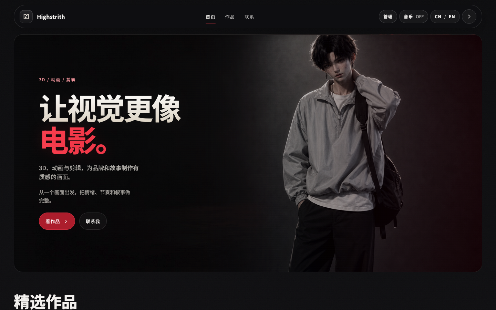
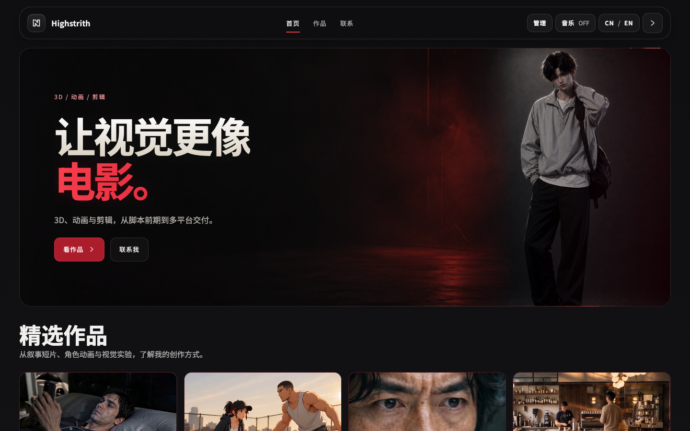
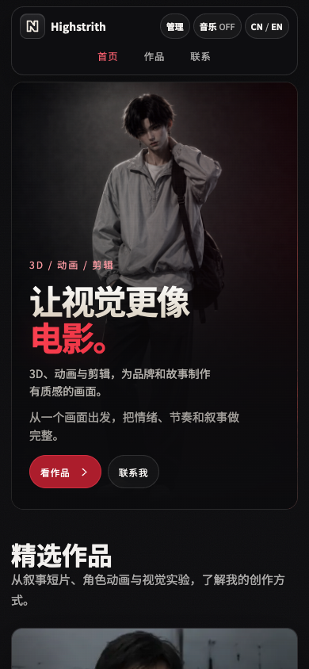
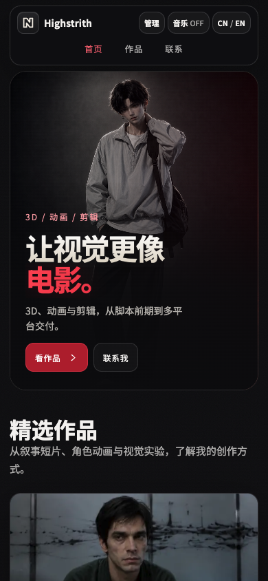
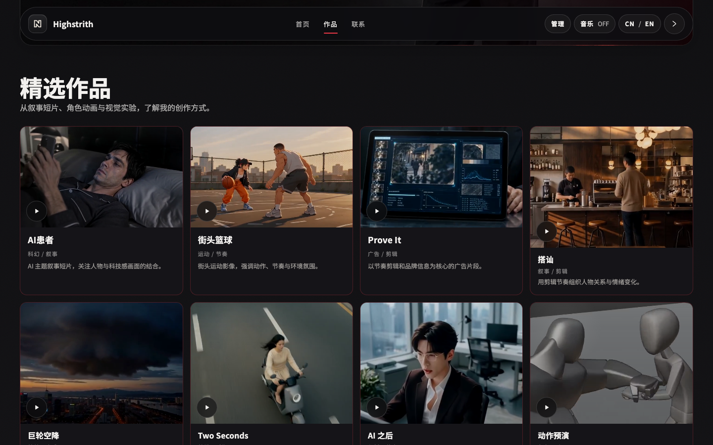
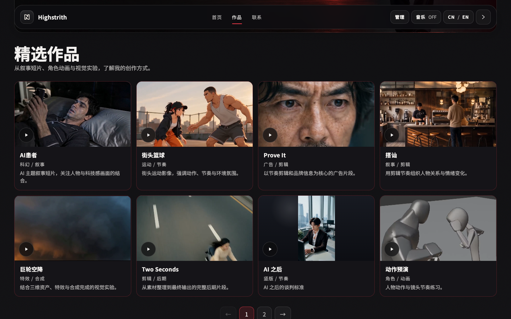

# 第二阶段：完整作品画面与舞台感视觉动效

本轮保留黑红品牌、数字人照片、作品顺序与分页，以完整作品画面和更有层次的进入节奏精修现有页面。实施方案见 `plans/2026-09-28-stage-visuals.md`。

## 设计依据

- 作品以完整画面和原始调色表达作者判断。所有卡片统一 16:9，横竖素材完整显示，必要时用深色留边；取消按前三张位置区分比例的旧样式。
- 通过缩短 Hero 和合并介绍，让首屏底部露出作品，同时保留数字人形象与两条行动入口。
- 首屏标题从分行遮罩内进入，人物和按钮分层衔接；章节与作品进入更短。参考 [Codrops ScrollTextMotion](https://github.com/codrops/ScrollTextMotion) 的排版动效方向，以原生动画实现中文分行编排，使用自身素材。
- 一套红色交互、清楚的文字和焦点环建立统一感。作品画面不依赖滤镜、持续缩放或动画来保持可读性。

## 前后对照

截图均来自同一本地预览，桌面 1440×900，手机 390×844，中文；前图为第二阶段开始前的 bf4bcba。网格截图取自播放中的预览，前后帧不同，主要对比画框与文字布局。

### 桌面首屏：调整前

### 桌面首屏：调整后

### 手机首屏：调整前

### 手机首屏：调整后

### 作品网格：调整前

### 作品网格：调整后

## 验证状态

本机 Chromium 真实浏览器、字体加载结束后的实测：

| 视口 | 语言 | Hero 高度 | 首屏可见作品图像 |
|---|---|---|---|
| 1440×900 | 中文 | 540px | 122.08px |
| 1440×900 | 英文 | 540px | 92.59px |
| 390×844 | 中英文 | 464px | 127.14px |
| 820×950 | 中英文 | 570px | 保持 2 列布局 |
| 320×760 | 中英文 | 450px | 入口可见，无横向溢出 |

- 最终 12 项真实浏览器回归通过，覆盖完整画面、行内对齐、文字对比度、入场预算及只执行一次、减少动态效果、动画能力缺失/异常、快速关闭重开与资源/焦点清理、无脚本访问及全屏退出。
- 最终审查发现并修复旧全屏退出完成回退新播放器方向的问题；补充真实原生全屏的延迟完成测试，同时验证新作品横屏不被回退、普通关闭正常复位。根代理独立运行该项与快速开关测试，2 项通过。
- 第一阶段 7 项播放回归通过；纯静态文件验证桌面/手机播放、减少动态效果、语言与无脚本链接；既有布局、媒体、手机、脚本语法和资源引用检查通过。Ego 再次观测 8 项同时播放，检查首屏、作品网格及前后截图。
- 13 项媒体全量解码、时长、索引和原文件哈希校验通过；12 项管理接口和 5 项目录特殊文本测试通过。原视频、衍生资源和作品目录均未修改。

复现命令：先运行 `node serve.js`，再执行 `python3 tests/stage-visuals-smoke.py`；第一阶段命令见 `媒体优化使用说明.md`。

限制：页面后台取消以注入 `document.hidden` 和派发公开 `visibilitychange` 信号验证，使用真实原生动画和页面处理器；自动化浏览器未触发真实系统隐藏状态，因此这不等于已验证 macOS/iOS 后台调度。未验证真实移动设备、Safari/Firefox 和弱网。交付仅在本地分支，未合并、推送或发布。
