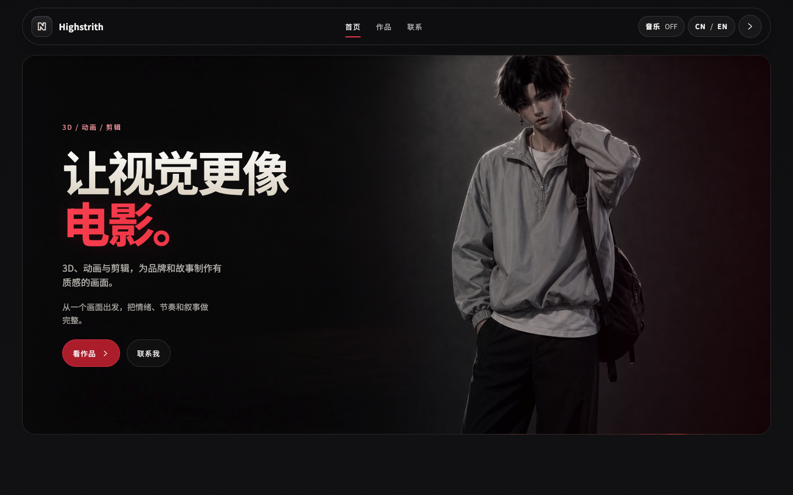
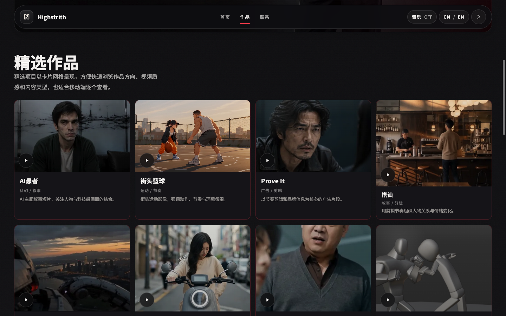
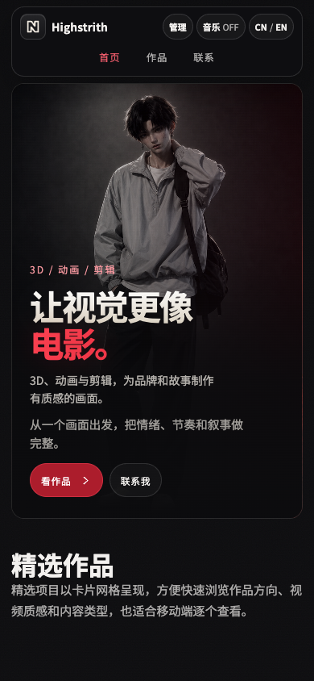
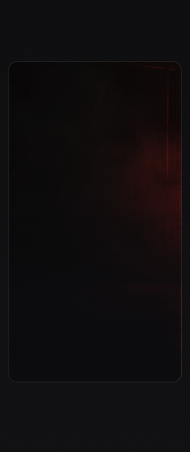

# Highstrith / -橘小桔- 网站评估与优化方案

评估日期：2026-09-28。对象：本地 `main` 分支 `d7d098d`，以及 [当前线上网站](https://highstrith.github.io/highstrithstate/)。

**建议保留黑红电影感与数字人形象，把优化重心放在作品呈现、能力证明、播放体验和有节奏的动效。** 当前视觉已经具有方向，进一步提升需要让访客更快看到代表作，并理解你在每个项目中做了什么。

本报告中的“动销”按“动效”理解，同时评估合作咨询的转化路径。以下优劣判断属于设计评审意见；文件体积、布局、播放与代码检查属于实测或源码证据。方案尚未应用到公开页面。

## 1. 评估范围与方法

- 依次阅读项目的协作规则、产品需求、软件架构和当前进度。
- 用 Ego 浏览器检查本地与线上页面，覆盖 1440×900 桌面、820×950 平板、390×844 手机、320×760 英文手机。
- 检查作品列表、播放器开合、键盘焦点、手机视频加载、中英切换，以及禁用 JavaScript 时的降级效果。
- 统计 13 个作品的实际文件体积、MP4 容器结构、时长与平均总码率。
- 查阅优秀网站的官方页面与 GitHub 仓库，区分视觉创作者、开发者作品集和动效实验三类参考。
- 运行 `node tests/media-integration.mjs`、`node --check serve.js`，两项通过。既有 Python 浏览器测试未在本轮重新运行。

本轮没有做真实用户访谈、咨询转化统计或线上 Core Web Vitals 测量，也没有给出虚构的 Lighthouse 分数。浏览器模拟不能替代真实安卓、iPhone 和国内移动网络测试。

## 2. 当前值得保留的优点

| 优点 | 目前的表现 | 为什么值得保留 |
| --- | --- | --- |
| 视觉方向明确 | 黑色背景、暗红影棚、大标题、数字人形象 | 与 3D、动态视觉、剪辑的创作定位相符，可以继续发展成个人识别系统 |
| 真实作品数量充足 | 已有 13 项，涵盖叙事、广告剪辑、角色动画、特效、片头等 | 有足够内容支撑案例和分类，无需用装饰模块填充首页 |
| 首屏行动清晰 | “看作品”和“联系我”两个入口 | 访客可以直接进入核心任务 |
| 手机加载策略正确 | 手机列表只显示封面，点击才加载视频 | 降低无意产生的网络与解码开销；390px 与 320px 模拟下未出现横向溢出 |
| 基础交互有可访问性考虑 | 卡片可键盘触发，播放器锁定背景焦点，Esc 关闭后返回卡片 | 这些行为应该成为后续优化的回归标准 |
| 联系与维护能力完整 | 邮件、电话、4 个社交入口、中英切换、本地管理、静态部署 | 已具备个人作品集的实用基础；线上管理入口确实隐藏，音乐默认关闭 |

关于与制作流程也已存在，比只有视频网格更完整；后续应增加具体证据，让这些文字更有说服力。

## 3. 目前的主要短板

### 3.1 首屏有气氛，但作品出现偏晚

在本地和线上 1440×900 视窗中，第一张作品卡片的顶部约为 **1000px**。访客看到人物和宣言后，还需要继续滚动才能看到作品画面。390×844 手机中，首张作品顶部约为 **810px**，首屏基本只露出作品区说明。

数字人占据较大视觉面积，身份、服务价值与实际作品之间的关联还可以更强。标题“让视觉更像电影”有记忆点，但下方两段说明都在表达画面、情绪与叙事，信息略有重复。

**建议：** 保留标题和人物，压缩重复说明与区块间距；桌面 Hero 初始设计目标为约 540–580px，手机约 450–490px，随后按实际排版调整。让首屏底部露出代表作图像，同时保持按钮可见。用一句具体的“脚本 → 制作 → 剪辑 → 多平台交付”介绍连接宣言和能力。

### 3.2 作品更像目录，项目判断信息不足

目前卡片包含标题、分类与一句描述，点击后直接播放。访客很难判断：作品属于原创、练习还是合作项目；你负责哪些环节；遇到什么问题；作品为什么值得选择。

说明文字“以节奏剪辑和品牌信息为核心”等适合概括方向，却还不能证明制作能力。部分标题和翻译不一致，例如中文目录的 `Two Seconds` 对应英文 `Exported Film`，`AI 之后` 的英文标题仍为中文。项目文档也记录部分新增作品使用临时名称。

**建议：** 先给 3 个代表项目补充真实的项目类型、职责、创作目标、制作难点与交付形式，再逐步补全其他作品。原创、素材练习和客户合作应明确标注。没有确认的客户、结果或职责，留空并隐藏对应模块。

### 3.3 “三组代表作”的设计意图没有完整呈现

HTML 初始写着“先看三组最能代表我的作品”，但语言初始化会把它覆盖为“精选项目以卡片网格呈现……”这类界面说明。实际页面仍是 4 列网格，没有明确的三组结构。

代码通过 `:nth-child(-n + 3)` 给前三张设置 `16 / 10`，第四张及后续使用 `4 / 3`。第一行容器等高，图片底部却不齐，前三张的文字区留下更多空白。第二页的前三张也会得到相同样式，无法稳定表达哪几个作品是代表作。

**建议：** 第一阶段保留既有桌面 4×2、每页 8 个的产品约定，统一常规卡片比例；用作品 ID 或明确的 `featured` 字段选代表作。代表作应按叙事、动态视觉、商业表达等能力覆盖选择，最终顺序需要逐片评审，不能仅按上传时间或文件大小决定。

### 3.4 媒体仍是交付文件的体量

| 实测项 | 结果 | 含义 |
| --- | --- | --- |
| 13 项视频总大小 | 410.48 MiB | 是目录文件总量，**并非首页一次加载量** |
| 第一页 8 项总大小 | 328.61 MiB | 用原片作预览时，持续播放会产生较高流量 |
| 最大单文件 | AI患者，90.85 MiB | 无专用手机版本，弱网起播与持续播放都需要关注 |
| 移动端专用文件 | 0 / 13 | `mobileVideo` 字段全部为空，完整播放器使用原视频 |
| 播放索引在文件末尾 | 8 / 13 | 需要尾部范围请求读取索引；网络往返和服务端 Range 支持会影响起播 |
| 线上作品区预览 | 一次观测到 8 个已加载并播放 | 可见区及 120px 缓冲区同时触发原视频播放，没有预览并发上限 |
| 预览资源实现 | `workPreviewFor()` 返回空值 | 没有独立的短视频预览路径 |

平均总码率按文件字节数 × 8 ÷ MP4 时长估算，包含音频及容器开销。例如“搭讪”约 11.57 Mbps、“动作预演”约 15.11 Mbps、“花与兔子”约 15.77 Mbps。它们有充分的网页分发优化空间，但清晰度需通过画面复核决定。

索引在末尾的作品：Prove It、搭讪、巨轮空降、Two Seconds、动作预演、街巷角色动画、能量实验、花与兔子。FFmpeg 的 `faststart` 可以把索引移到前部，改善流式起播；它不会降低视频码率，也不代表目前这些文件无法播放。[官方格式说明](https://www.ffmpeg.org/ffmpeg-formats.html)

**建议：** 将媒体分成封面、短预览、完整网页播放版三层。短预览采用约 4–8 秒、540p/720p、无音轨的循环片段，初始预算约 0.5–2 MiB；手机播放版初始采用约 720p、1.5–3 Mbps，细节要求高的片段再提高。桌面同时播放最多 2 项，其他显示封面；这些数值是待验证的设计预算。

### 3.5 页面文案与联系路径还可更贴近合作决策

“精选项目以卡片网格呈现……”解释的是网页结构，未帮助访客选择作品。关于和流程区强调创作态度，但缺少与实际项目对应的过程画面。联系区虽然入口齐全，国内访客更常用的微信仍与其他社交平台放在同级位置。

**建议：** 作品区改成选择提示，如“从叙事短片、角色动画与视觉实验，了解我的创作方式”；流程区用一个真实项目的分镜、制作帧、最终画面连接三步流程。联系区根据目标受众设置“微信聊项目”和“邮件联系”两条路径；保留现有二维码与账号。手机端补“复制微信号”，显示复制成功或失败，不依赖同一部手机扫描自己的屏幕。

### 3.6 视觉细节尚未完全统一

旧样式中仍保留金色的按钮悬停、社交悬停和部分渐变，与当前红色主视觉不一致。不同作品又叠加亮度、饱和度与对比度滤镜，可能削弱原片调色表达。通用圆角面板较多，作品、流程和联系的视觉重量接近，页面节奏容易平铺。

分类文字约 11.2px，使用 `rgba(244,242,240,0.46)`；在卡片 `#151419` 背景上进行透明度混合后，对比度约 **4.30:1**，低于普通文字的 4.5:1 门槛。描述文字实际约 12.48px，颜色约 56% 不透明度，虽然不是同一对比度问题，但阅读尺寸仍偏小。[W3C 对比度说明](https://www.w3.org/WAI/WCAG22/Understanding/contrast-minimum.html)

**建议：** 一套红色交互令牌、一套圆角尺度；常规正文 15–16px、作品说明至少 14px、分类至少 12–13px。作品画面保持原始色彩，主要通过边框、文字和少量背景统一站点气质。流程改为线性编排，减少每个模块都包一层卡片的感觉。

### 3.7 动效已存在，但缺少主次

已有入场淡入、卡片轻微上移与视频自动播放，交互不是静态空壳。然而整页元素多采用相似的 700ms 淡入，用户注意力缺少明确的导演节奏；同时作品内容本身已在运动，过多附加运动会互相竞争。

**建议：** 主标题有一次明显的分行进场，作品卡片用短暂且克制的悬停反馈，播放器用较快开合；关于和流程的动效保持更轻。具体参数见第 6 节。

### 3.8 搜索、分享与失败降级仍不完整

- 线上 `<head>` 有标题和描述，但没有 Open Graph、Twitter 分享卡、canonical 和结构化个人资料。
- 外部 Google Fonts 加载两套字体，字体服务可达性成为首屏依赖；中文与英文字体都能进一步精简。
- 禁用 JavaScript 实测时，`.reveal { opacity: 0 }` 让导航、Hero 文案和人物不可见，作品网格也为空。脚本异常时存在相似风险。
- 完整播放器没有独立的应用层加载、失败与重试说明，主要依靠原生视频控件；失败原因不容易理解。
- 单页无法直接分享某个作品的完整背景介绍，客户端渲染也让部分抓取器更难获得作品内容。不能据此断言搜索引擎完全无法收录。

**建议：** 默认可读，脚本就绪后才启用动画隐藏；提供静态作品摘要与无脚本播放链接。补全真实的分享信息和预览图。字体优先系统中文或本地精简 WOFF2。播放器增加“正在加载 / 加载失败 / 重试”，保留关闭与原生控件；先把详情放进现有播放器面板，再按需要规划可分享地址。

## 4. 优秀网站对照与可借鉴部分

以下不是排行榜。选择依据是与你的目标相关的可见设计与内容机制，GitHub 星数不作为质量评分。

| 参考 | 核实到的特点 | 适合借鉴 | 套用到你的网站时的代价或限制 |
| --- | --- | --- | --- |
| [Ash Thorp / ALT Creative](https://www.altcinc.com/)，[THE BATMAN 案例](https://www.altcinc.com/work/batman) | 同属设计、VFX、动画与导演创作；案例列出年份、类别、设计过程、概念图和职责署名 | 最贴近你的内容参考：成片之外展示过程和贡献，作品图片主导页面 | 需要整理自己的真实过程素材；大型图库和长页面应按需加载 |
| [Brittany Chiang 当前站](https://brittanychiang.com/)，[v4 源码](https://github.com/bchiang7/v4) | 身份明确，项目有用途和技术信息，经历构成能力证据；v4 是旧版 Gatsby 作品集 | 学内容层级、项目上下文、明确行动和键盘体验 | 当前站与 v4 不是同一版本；开发者履历式排版不宜直接搬到影像作品集 |
| [Anthony Fu](https://antfu.me/)，[源码](https://github.com/antfu/antfu.me) | 简洁的身份说明，将项目、文章、演讲和摄影连接成个人内容体系 | 个人语气、清晰索引、让不同内容共同证明身份 | 其主要媒介是文字与链接；你的作品需要更大的画面面积 |
| [Bruno Simon](https://bruno-simon.com/)，[folio-2025 源码](https://github.com/brunosimon/folio-2025) | 可驾驶的 3D 作品集，项目本身展示创意开发能力；源码包含游戏循环和资产压缩流程 | 学“网站体验本身证明能力”的思路，后续可做独立的互动实验入口 | 完整 3D 世界有持续加载、GPU、导航与维护成本，当前阶段投入偏高；本轮主要核对官方代码和页面说明，未做完整游玩评估 |
| [Codrops ScrollTextMotion 演示](https://tympanus.net/Development/ScrollTextMotion/)，[源码](https://github.com/codrops/ScrollTextMotion) | GSAP 滚动文字实验，有明显的编排和字符变化；本轮实际查看滚动状态 | 学标题出现的节奏，把一次关键转场做精致 | 实验中的持续字符扰动会损害中文阅读；应改为分行、单次出现 |
| [Codrops ImageExpansionTypography 演示](https://tympanus.net/Development/ImageExpansionTypography/)，[源码](https://github.com/codrops/ImageExpansionTypography) | 在排版内部展开图像的滚动实验 | 可用于一个代表作的章节转场，让画面接住标题 | 不宜每个区块重复，手机端应有静态布局；本轮核对演示与仓库说明，未做全设备测试 |

可补充参考 [Lenis 官方仓库](https://github.com/darkroomengineering/lenis) 的平滑滚动处理，但首轮保留原生滚动更合适。官方说明列出 iframe、嵌套滚动、部分 Safari 和旧 iOS 的限制；引入时需要额外验证弹窗滚动、锚点和减少动态效果。

借鉴时应区分代码许可与内容许可。例如 Anthony Fu 仓库注明代码为 MIT，文字与图片为 CC BY-NC-SA；Brittany v4 要求适当署名。此方案采用设计机制与自身素材，实际复用代码时再记录对应来源。

## 5. 三条优化路线

| 路线 | 内容 | 收益 | 成本与取舍 |
| --- | --- | --- | --- |
| **A：保留品牌，强化作品与体验（推荐）** | 黑红、人物、现有锚点与分页保留；统一卡片、压缩媒体、补案例信息、精修动效 | 最快提高阅读、播放和合作判断的质量，保持现有识别 | 视觉变化较克制，依靠真正的作品内容拉开差距 |
| B：影像编辑式重排 | 独立三部大幅代表作，再列完整作品；更少面板、更强排版与画面章节 | 有更鲜明的视觉创作者气质，更接近作品展 | 改变当前 4×2 目录约定，需要重定内容顺序和产品验收 |
| C：互动 3D 实验 | 增加可探索场景或角色交互，作为独立实验入口 | 有机会形成强记忆点，直接展示互动能力 | 维护和手机性能成本最高；需要实际交互资产及明确目的 |

推荐先完成 A。之后以实际作品观看、案例阅读和咨询数据决定是否进入 B 或 C。

### 推荐视觉方向

面向潜在合作方的个人影像作品集，采用现有电影感黑红语言，以作品画面、清晰排版和克制动效构建识别。

- 背景：延续 `#08080b`，面板 `#151419`，减少大面积渐变。
- 强调色：延续 `#ed4050`，悬停、焦点、按钮和社交入口统一；主按钮采用更深红底保证文字对比度。
- 字体：中文系统无衬线或精简本地 Noto；英文使用现有 Space Grotesk，并明确应用在英文内容与项目编号中。
- 圆角：作品、按钮与弹窗形成少量固定尺度，例如 12 / 16 / 24px；现有字标保留。
- 首屏文案：保留“让视觉更像电影。”；辅文候选“3D、动画与剪辑，从脚本前期到多平台交付。”；人物附近以小标签说明是数字人创作形象。
- 作品：统一常规卡片图像比例，按单个作品设置焦点裁切；竖版内容保留完整观看入口，避免把关键人物或字幕裁掉。
- 关于：连接“我重视什么”与“具体如何做”，用一个项目中的实际选择证明创作观。
- 联系：微信和邮件形成明确的咨询路径，四个社交入口继续负责关注与内容发现。

第一阶段仍采用当前“首屏 → 作品 → 关于 → 流程 → 联系”的结构。重点增强以下访问路径：


## 6. 可直接实施的动效规范

下列参数是推荐起点，完成后用真实画面和手机测试调整。原则是作品内容的运动优先于界面运动。

| 位置与触发 | 推荐效果 | 初始参数 | 降级与验收 |
| --- | --- | --- | --- |
| 首次进入 Hero | 标题按两行顺序出现，简介和按钮随后进入；人物更轻地淡入 | 标题 `translateY(20px) → 0` + opacity，480–600ms；行间隔 80ms；总编排控制在约 800ms 内 | 减少动态效果时直接显示；静态内容默认可见；不用中文逐字拆分扰乱阅读 |
| 作品区首次进入视窗 | 卡片分行短暂淡入，避免大量延迟 | `translateY(12px)`，350–450ms；同一行错开 40–60ms；只执行一次 | 快速滚动时及时显示，分页后不重复播放整页仪式 |
| 桌面悬停 / 键盘聚焦 | 小幅图像放大、红色边框反馈，文字保持稳定 | 图像 `scale(1) → 1.025`，220–280ms；卡片最多上移 2px | 触屏不依赖悬停；键盘使用清晰焦点环；不做三维倾斜 |
| 点击打开完整播放器 | 背景淡入，面板轻微放大到位 | opacity + `scale(.98) → 1`，180–240ms | 焦点立即进入面板，关闭后归还；减少动态效果时瞬时切换 |
| 关闭播放器 | 快速退出并恢复当前浏览位置 | 120–160ms | 不改变分页与滚动位置，不继续加载旧视频 |
| 关于 / 流程 | 章节标题轻微出现，正文保持稳定；用真实过程帧连接三步 | 单次，250–350ms | 手机使用纵向静态流程；不可用固定长滚动锁住用户 |
| 二维码弹出 | 轻微淡入与 4px 位移 | 120–160ms | 可点击、可关闭、完整显示；触屏保持原生对话框路径 |

技术优先使用 CSS、IntersectionObserver 和 Web Animations API。确实需要章节时间线时再引入 GSAP / ScrollTrigger；不必为了几种轻动效迁移 React。持续运动只使用 transform 和 opacity，较重的图像展开仅用于单个代表作且经性能验证。

自定义光标、整页粒子、自动响起的音乐、强制横向滚动、长加载片头和全页面大视差，都不作为这轮方案的交付内容；它们对观看作品和发起咨询的帮助目前缺乏证据。

## 7. 分阶段实施清单

时间为开发工作量估计，取决于素材与项目职责信息是否已准备好，不构成交付承诺。

| 顺序 | 工作 | 涉及模块 | 交付与验收 | 工作量估计 |
| --- | --- | --- | --- | --- |
| **第一阶段：播放与阅读基础** | 对 8 项尾索引视频制作 faststart 网页副本；生成短预览及手机版本；补播放器加载、失败、重试；修复文案回退和渐进显示 | `assets/`、`data/works.json`、`index.html` 媒体选择/播放器/语言逻辑；如增加预览字段，同步 `serve.js` 与 `admin.html` | 手机列表 0 个视频请求；桌面预览最多 2 项；慢网/失败可解释且可重试；原片保留，卡片与播放器使用各自资源 | 1–2 天 |
| **第二阶段：视觉与动效** | 缩短首屏、统一红色交互与文字层级、统一图片比例、按 ID 标记代表作；实现第 6 节动效 | `index.html` 样式、Hero、作品渲染、观察器；产品约定发生变化时同步需求文档 | 1440×900 能看到代表作图像；320px 中英无溢出；减少动态效果完全可用；作品原始调色不被全局滤镜覆盖 | 1–2 天 |
| **第三阶段：能力证明与咨询** | 3 项案例补全职责、过程与交付；播放器增加信息面板；微信复制反馈；校正标题和翻译 | `data/works.json`、`index.html`、本地编辑器的数据字段 | 每个代表作都有真实且可核对的项目类型和职责；未填写字段隐藏；用户可在手机直接复制微信号 | 1–2 天 + 素材整理 |
| **第四阶段：分享与验证** | OG / canonical / 分享图 / 真实个人资料；精简字体；国内移动网络测试；需要时增加作品地址与统计 | `<head>`、字体资产、发布流程与必要的静态生成工具 | 分享显示真实标题与图；验证弱网起播、iOS/安卓、键盘、二维码、中英、静态回退；公开地址变化提前纳入产品约定 | 0.5–1 天，另需真实设备 |

媒体制作命令的候选配置如下，实际执行时写入新路径，不覆盖原片；需要先具备 FFmpeg，当前环境未发现可用的 `ffprobe`：

```sh
# 网页封装副本：保持编码，前移播放索引
ffmpeg -i source.mp4 -c copy -movflags +faststart source-web.mp4

# 720p 手机播放版：先以 CRF 控制质量，随后检查实际体积与细节
ffmpeg -i source.mp4 -vf "scale=-2:720:force_original_aspect_ratio=decrease" \
  -c:v libx264 -crf 25 -preset medium -pix_fmt yuv420p \
  -c:a aac -b:a 96k -movflags +faststart source-mobile.mp4

# 示例短预览：截取经人工选定的 6 秒，去除音轨
ffmpeg -ss 0 -i source.mp4 -t 6 \
  -vf "scale=-2:540:force_original_aspect_ratio=decrease" \
  -an -c:v libx264 -crf 27 -preset medium -pix_fmt yuv420p \
  -movflags +faststart source-preview.mp4
```

以上为方案中的参考命令，本轮未转码。竖版视频和细节丰富的特效应单独复核尺寸与压缩质量；CRF 输出不会保证固定码率。

新增元数据优先保持简单：`previewVideo` 负责短预览，现有 `mobileVideo` 负责手机完整播放；`featured` 或固定 ID 列表负责策展；`projectType`、`roles`、`brief`、`processImages`、`deliverables` 负责案例。必须同步前端规范化、本地服务写入与编辑器，否则保存时可能丢失新增字段。`file://` 快照也需要同步或由小工具生成。

## 8. 验收与效果判断

- 体验：进入页面后能认清身份、看到代表作入口；打开作品可看到职责和播放状态；关闭后返回原卡片；联系入口可直接使用。
- 性能：使用固定设备与网络条件记录首屏资源量、预览流量、首帧等待和卡顿；用相同条件比较改前改后。视频总容量不能替代真实下载流量指标。
- Core Web Vitals 的公开目标为 LCP ≤ 2.5s、INP ≤ 200ms、CLS ≤ 0.1，并按移动/桌面真实访问的第 75 百分位判断；本轮没有测得这些实际成绩。[Google 官方说明](https://web.dev/articles/vitals)
- 可访问性：普通文字对比度至少 4.5:1；键盘、减少动态效果、屏幕放大、无脚本降级都能完成主要阅读与联系任务。
- 内容：3 个代表作有真实项目类型、职责和过程信息；中英名称一一对应；禁止用未确认的客户与结果补空白。
- 咨询：未来可以观察作品打开率、案例阅读率、微信复制/邮件点击率。点击不等于咨询，更不等于成交，不能在没有数据时声称转化率提高。

## 9. 页面证据

以下为本轮浏览器截图。线上截图没有本地“管理”按钮；手机与无脚本截图来自本地同版页面。

### 线上桌面首屏，1440×900



### 线上作品区，1440×900



### 本地手机首屏，390×844



### 禁用 JavaScript 的本地手机首屏



## 10. 对应代码位置

- [首屏元信息与字体依赖](/Volumes/E61--/网站/site/index.html:1)
- [默认隐藏的入场元素](/Volumes/E61--/网站/site/index.html:901)
- [黑红视觉、作品卡片与比例设置](/Volumes/E61--/网站/site/index.html:1377)
- [作品区初始策展文案](/Volumes/E61--/网站/site/index.html:1689)
- [覆盖策展文案的语言字符串](/Volumes/E61--/网站/site/index.html:1871)
- [手机播放资源与缺失的独立预览选择](/Volumes/E61--/网站/site/index.html:2151)
- [视窗与缓冲区内的原视频自动预览](/Volumes/E61--/网站/site/index.html:2302)
- [完整播放器加载与播放](/Volumes/E61--/网站/site/index.html:2482)
- [作品目录](/Volumes/E61--/网站/site/data/works.json:1)

报告形成了可执行的优化范围，但没有修改公开页、作品媒体或部署。后续实施建议从第一阶段开始，保留当前交互中已验证的优点。
